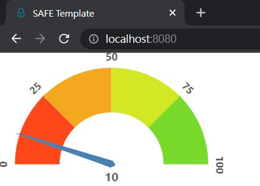

# React wrapper practice

> ref:<https://www.compositional-it.com/news-blog/f-wrappers-for-react-components/>

## Environment install

* [.NET 5](https://dotnet.microsoft.com/download/dotnet/5.0)
* [NPM](https://www.npmjs.com/get-npm)

## pre-requisites

* Open cmd on the `practice` folder.

* Run the following command:

* Installs the .NET local tools that are in scope for the current directory.

```powershell
dotnet tool restore
```

- Install react components <https://www.npmjs.com/package/react-d3-speedometer>

```powershell
npm install react-d3-speedometer
```

* Run the app

```powershell
dotnet run
```

## Feliz.ReactSpeedometer.fs

1. In the Client directory create a new file `Feliz.ReactSpeedometer.fs`
2. Add file reference to Client.fsproj

```diff
    <ItemGroup>
        <None Include="index.html" />
        <None Include="paket.references" />
++        <Compile Include="Feliz.ReactSpeedometer.fs" />
        <Compile Include="Index.fs" />
        <Compile Include="App.fs" />
    </ItemGroup>
```

3. Add following code in `Feliz.ReactSpeedometer.fs`:

```fsharp
module Feliz.ReactSpeedometer

open Feliz
open Fable.Core.JsInterop

let reactSpeedometer: obj = importDefault "react-d3-speedometer"

type ReactSpeedometer =

    static member inline Value (number: int) = "value" ==> number
    static member inline MinValue (number: int) = "minValue" ==> number
    static member inline MaxValue (number: int) = "maxValue" ==> number
    static member inline Segments (number: int) = "segments" ==> number

    static member inline create props = Interop.reactApi.createElement (reactSpeedometer, createObj !!props)
```

4. In the `./src/client/index.fs` replace view function:

```fsharp
open Feliz.ReactSpeedometer
let view model dispatch =
    ReactSpeedometer.create [
        ReactSpeedometer.Value 10
        ReactSpeedometer.MaxValue 100
        ReactSpeedometer.MinValue 0
        ReactSpeedometer.Segments 4
    ]
```

That's the bare minimum we need to port over this component with type safety.

we can't pass anything other than an `int` to the props we've defined.

5. run the app, we will see this result:



## New a prop to our components

We want to add customSegmentLabels prop to our component.

Which from the [prop list](https://www.npmjs.com/package/react-d3-speedometer) takes an Array<CustomSegmentLabel> and from the [code](https://github.com/palerdot/react-d3-speedometer/blob/HEAD/src/index.d.ts) is defined as:

```javaScript
enum CustomSegmentLabelPosition {
    Outside = "OUTSIDE",
    Inside = "INSIDE",
}

type CustomSegmentLabel = {
    text?: string
    position?: CustomSegmentLabelPosition
    fontSize?: string
    color?: string
}
```

1. Add the F# translation of the above code to `Feliz.ReactSpeedometer.fs.`

```fsharp
type CustomSegmentLabelPosition =
    | Outside
    | Inside
        with static member toJSValue = function 
            | Outside -> "OUTSIDE"
            | Inside -> "INSIDE"

type CustomSegmentLabel =
    { Text: string
      Position: CustomSegmentLabelPosition
      FontSize: string
      Color: string }
```

2. We need to add the prop within the ReactSpeedometer type.

```fsharp
type ReactSpeedometer =
    ....
    static member inline CustomSegmentLabels (customSegmentLabels: CustomSegmentLabel []) = "customSegmentLabels" ==> customSegmentLabels
```

3. Add new prop to the component in the index.fs `view`.

```fsharp
let view (model: Model) (dispatch: Msg -> unit) =
    ReactSpeedometer.create [
        ReactSpeedometer.Value 10
        ReactSpeedometer.MaxValue 100
        ReactSpeedometer.MinValue 0
        ReactSpeedometer.Segments 4

        ReactSpeedometer.CustomSegmentLabels [|
            { Text = "Hi"
              Position = Inside
              FontSize = "20px"
              Color = "crimson" }
            { Text = "From"
              Position = Outside
              FontSize = "20px"
              Color = "blue" }
            { Text = "Feliz"
              Position = Inside
              FontSize = "20px"
              Color = "green" }
            { Text = "Speedometer"
              Position = Outside
              FontSize = "20px"
              Color = "purple" }
        |]
    ]
```

4. Because F# record(above code) doesn't directly translate to a JS object. So we can add a member to CustomSegmentLabel which will map our F# record into an anonymous record with lower cased fields.

```fsharp
type CustomSegmentLabel =
    { Text: string
      Position: CustomSegmentLabelPosition
      FontSize: string
      Color: string }

    // new code to add below
    static member toJSObj customLabel =
        {| text = customLabel.Text
           position =
            customLabel.Position
            |> CustomSegmentLabelPosition.toJSValue
           fontSize = customLabel.FontSize
           color = customLabel.Color |}
```

5. Finally, call the static member in the prop

```fsharp
static member inline CustomSegmentLabels (customSegmentLabels: CustomSegmentLabel []) =
    let jsCustomSegmentLabels = customSegmentLabels |> Array.map CustomSegmentLabel.toJSObj
    "customSegmentLabels" ==> jsCustomSegmentLabels
```

6.See result.
